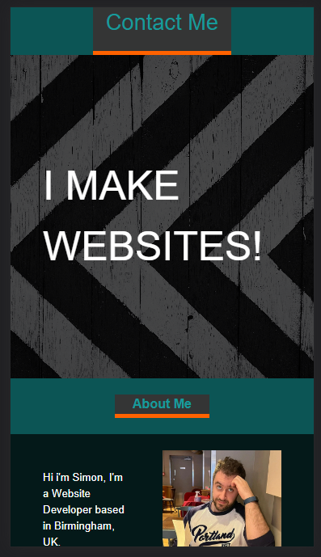

# My Portfolio

## Description

This webiste is my first Portfolio website, the intention is to continue to add to this site as I complete new projects. Currently my first project "HTML/CSS Refactoring" is live and accessible through the main image of the "Work" section.

## Table of Contents

* [Installation](#installation)
* [Usage](#usage)
* [License](#license)

## Installation

Visit URL: https://symoxn7.github.io/portfolio/

## Usage 

To navigate the website please select one of the options on the nav bar. They will take you to the coresponding sections.

In the "Work" sections the largest image is also a link to my Refactoring project.

Below is a screenshot of the header/nav sections of the site

```md

```

Below is a screenshow showing the websites mobile adaptation

```md

```

## License

MIT License

Copyright (c) 2023 Symox

Permission is hereby granted, free of charge, to any person obtaining a copy
of this software and associated documentation files (the "Software"), to deal
in the Software without restriction, including without limitation the rights
to use, copy, modify, merge, publish, distribute, sublicense, and/or sell
copies of the Software, and to permit persons to whom the Software is
furnished to do so, subject to the following conditions:

The above copyright notice and this permission notice shall be included in all
copies or substantial portions of the Software.

THE SOFTWARE IS PROVIDED "AS IS", WITHOUT WARRANTY OF ANY KIND, EXPRESS OR
IMPLIED, INCLUDING BUT NOT LIMITED TO THE WARRANTIES OF MERCHANTABILITY,
FITNESS FOR A PARTICULAR PURPOSE AND NONINFRINGEMENT. IN NO EVENT SHALL THE
AUTHORS OR COPYRIGHT HOLDERS BE LIABLE FOR ANY CLAIM, DAMAGES OR OTHER
LIABILITY, WHETHER IN AN ACTION OF CONTRACT, TORT OR OTHERWISE, ARISING FROM,
OUT OF OR IN CONNECTION WITH THE SOFTWARE OR THE USE OR OTHER DEALINGS IN THE
SOFTWARE.
